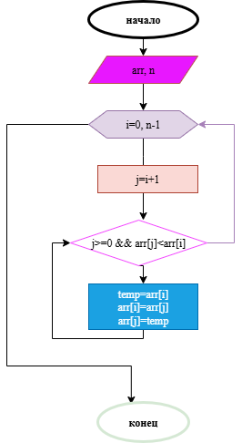

# Домашнее задание к работе 2

## Условие задачи
В течение месяца продавец доставлял на дом 4 л. молока в день. В марте молоко стоило **x** руб. за литр. С первого апреля цена молока увеличилась на **(x + a)** руб. за литр. Сколько надо заплатить продавцу за все доставленное молоко в конце апреля? Количество покупаемого молока осталось прежним.

## 1. Алгоритм и блок-схема

### Алгоритм
1. **Начало**
2. Объявить константы:
   - `DAILY_VOLUME` = 4 (л/день) — ежедневный объем покупки.
   - `DAYS_IN_MARCH` = 31 — количество дней в марте.
   - `DAYS_IN_APRIL` = 30 — количество дней в апреле.
3. Задать исходные данные:
   - `x` — цена 1 литра молока в марте (руб.).
   - `a` — величина, на которую базовая цена увеличивается в апреле (руб.).
4. Вычислить стоимость молока в марте:
   - `price_march` = `x`
   - `total_march` = `DAILY_VOLUME` * `DAYS_IN_MARCH` * `price_march`
5. Вычислить новую цену молока в апреле:
   - `price_april` = `x` + (`x` + `a`)
6. Вычислить стоимость молока в апреле:
   - `total_april` = `DAILY_VOLUME` * `DAYS_IN_APRIL` * `price_april`
7. Вычислить общую сумму к оплате:
   - `total_to_pay` = `total_march` + `total_april`
8. Вывести результаты расчетов с подстановкой всех значений в текст.
9. **Конец**

### Блок-схема
 *<!-- Вставьте ссылку на изображение вашей блок-схемы, созданной в draw.io -->*

## 2. Реализация программы

*<!-- Вставьте код программы-->*

## 3. Реализация программы

*<!-- После запуска программы просто скопируйте вывод из консоли и вставьте его в этот раздел -->*